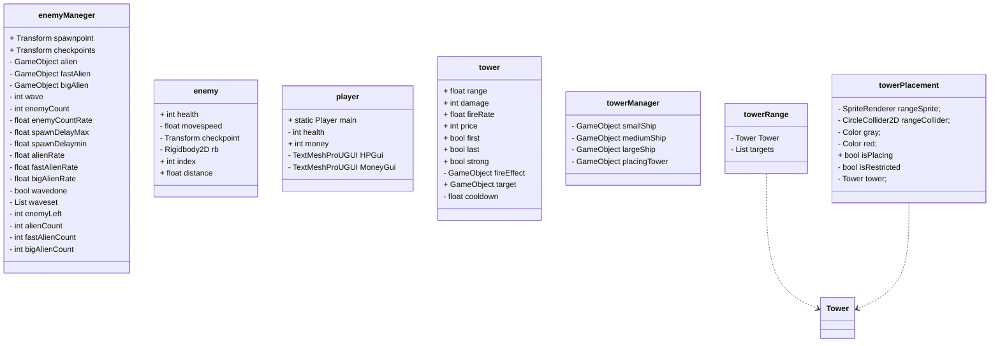

```mermaid
---
Title: Class Diagram Tower Defense
---

classDiagram

class enemyManeger{

    + Transform spawnpoint
    + Transform checkpoints

    - GameObject alien
    - GameObject fastAlien
    - GameObject bigAlien


    - int wave
    - int enemyCount
    - float enemyCountRate
    - float spawnDelayMax
    - float spawnDelaymin

    - float alienRate
    - float fastAlienRate
    - float bigAlienRate

    - bool wavedone
    - List<GameObject> waveset
    - int enemyLeft

    - int alienCount
    - int fastAlienCount
    - int bigAlienCount    
}

class enemy{

    + int health
    - float movespeed

    - Transform checkpoint

    - Rigidbody2D rb

    + int index
    + float distance
}

class player{

    + static Player main

    - int health
    + int money

    - TextMeshProUGUI HPGui
    - TextMeshProUGUI MoneyGui
}

class tower{


    + float range
    + int damage
    + float fireRate
    + int price
    
    + bool first
    + bool last
    + bool strong

    - GameObject fireEffect

    + GameObject target
    - float cooldown
}

class towerManager{
    
    - GameObject smallShip
    - GameObject mediumShip
    - GameObject largeShip

    - GameObject placingTower
}

class towerPlacement{
    
    - SpriteRenderer rangeSprite;
    - CircleCollider2D rangeCollider;
    - Color gray;
    - Color red;

    + bool isPlacing
    - bool isRestricted

    - Tower tower;
}

class towerRange{
    - Tower Tower
    - List<GameObject> targets
}


towerRange ..> Tower
towerPlacement ..> Tower

```