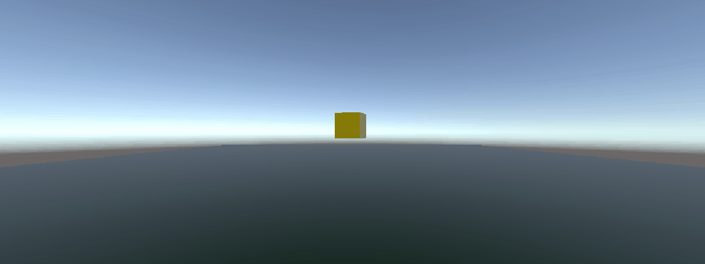
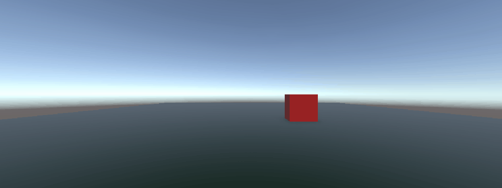
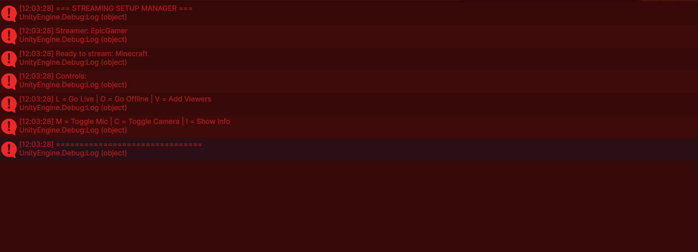
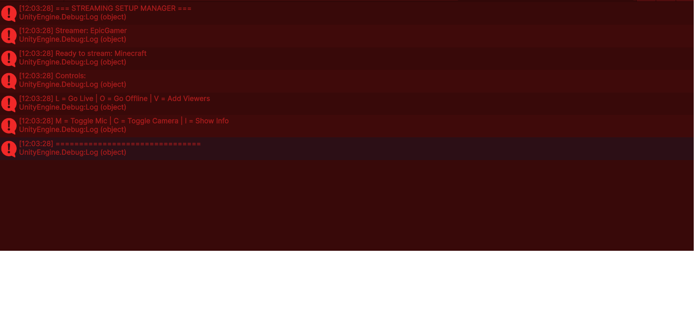
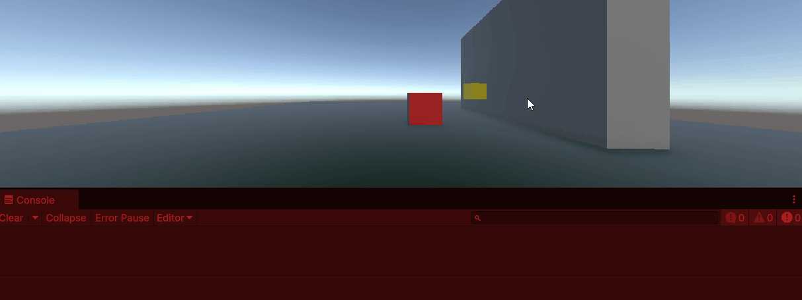
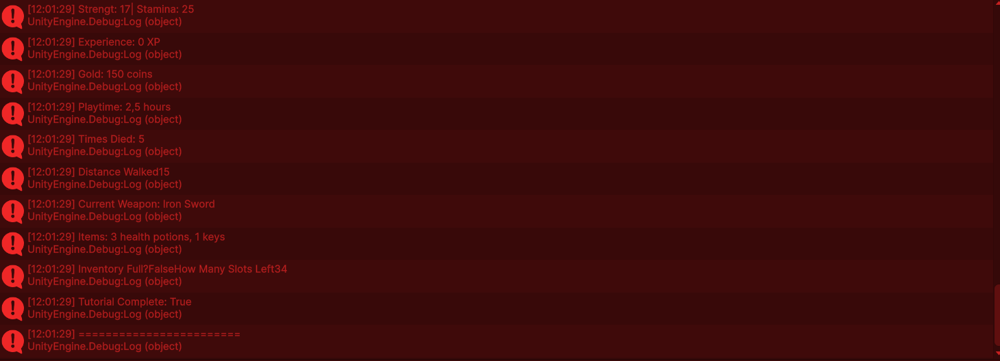

# 1

[text](Assets/Scripts/M1/CoinRotation.cs)
# 2 

[text](Assets/Scripts/M1/MoveLR.cs)
# 3

[text](Assets/Scripts/M1/MoveCircle.cs)
# 4

[text](Assets/Scripts/M1/PlayerStats.cs)
# 5

[text](Assets/Scripts/M1/MusicPlayer.cs)
# 6

[text](Assets/Scripts/M1/PlayerMove.cs)
# 7

[text](Assets/Scripts/M1/HealthStatus.cs)
# 8

[text](Assets/Scripts/M1/WeaponSwitch.cs)
# 9

[text](Assets/Scripts/M1/StreamingManager.cs)
#

